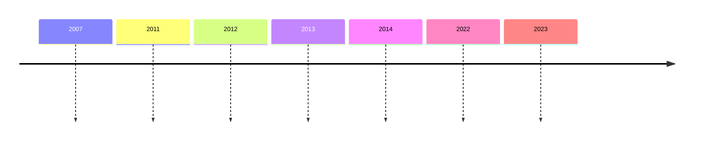

# Common Ailments in Community Pharmacy: A Collaborative Approach to Care

## Program Overview:

This is a 30-minute CCCEP-accredited eCME program for Canadian pharmacists and other healthcare professionals. The goal is to provide education on the expanded scope of practice for pharmacists across Canada with a focus on practical considerations for common ailment management. This program offers a thorough overview of the evolving role of pharmacists in patient care, practical strategies for managing common ailments, and actionable steps to integrate common ailments management into your clinical practice.

## Accreditation Information:

This version of the program is unaccredited and intended for informational purposes only.

## Sponsor:

This program has received internal financial support from MDBriefCase, and is not supported by a Sponsor.
---
# About this Course

**Program Title:** Common Ailments in Community Pharmacy: A Collaborative Approach to Care

## Description:

Common ailments are described as health conditions that can be managed with minimal treatment and/or self-care strategies. Across the country, provincial governments have approved regulations that expand the scope of practice for pharmacists to support the management of common ailments. This program provides practical information on the role of pharmacists in the collaborative care of patients with common ailments.

## Planning Committee:

- Carla Beaton, BScPhm, RPh, FASCP
- Aleksa Stankic, PharmD, RPh
- Kathy Li, PharmD, RPh
---
# Learning Objectives

Upon completion of this continuing education program participants will be better able to:

- Describe expanded scope of pharmacist practice across Canada with a focus on common ailments

- Identify practical considerations for common ailments management

- Recognize the importance of a collaborative care approach for common ailment management
---
# Pre-/Post-Course Survey

1. How familiar are you with the expanded scope of practice for pharmacists in Canada regarding common ailments management?

   a. Very familiar
   b. Somewhat familiar
   c. Slightly familiar
   d. Not familiar at all
---
# Pre-/Post-Course Survey

2. How comfortable are you with prescribing medications for common ailments?

   a. Very comfortable
   b. Somewhat comfortable
   c. Somewhat uncomfortable
   d. Very uncomfortable
---
# Pre-/Post-Course Survey

3. How comfortable are you with incorporating common ailment prescribing into your routine pharmacy practice?

a. Very comfortable

b. Somewhat comfortable

c. Somewhat uncomfortable

d. Very uncomfortable
---
# Pre-/Post-Test Questions

1. Which Canadian province was the first to lay the legislative groundwork for a pharmacist-led ambulatory condition program (PACP)?

   A. Nova Scotia
   B. Saskatchewan
   C. Alberta
   D. Manitoba
---
# Pre-/Post-Test Questions

2. Pharmacist prescribing for minor ailments (PPMA) programs promote efficiencies within the healthcare system by enabling pharmacists to prescribe or recommend the most appropriate treatment for certain common ailments.

   A. True
   B. False
---
# Pre-/Post-Test Questions

3. What are some benefits of software solutions in common ailment prescribing?

A. Digital documentation is faster to complete, easier to retrieve, and easier to share with other healthcare providers.
B. Automated booking reduces reliance on disjointed schedulers, scanning/attaching files, and human error from both patients remembering and staff prompting patients.
C. Implementing software solutions within a pharmacy workflow is challenging.
D. A and B
---
# Pre-/Post-Test Questions

4. Which of the following methods are suitable for networking with surrounding prescribers in a manner that is not exclusively work related?

A. Inviting them to a dinner
B. Scheduling a formal business meeting in the office
C. Using community events for informal meetings
D. Systematic prescriber outreach using an email campaign about common ailments or other quality of care improvement initiatives
E. A,C,D
---
# Pre-/Post-Test Questions

5. Establishing a rapport between pharmacists and prescribers fosters better communication, enhances patient care coordination, and ensures more comprehensive and consistent treatment plans.

   A. True
   B. False
---
# Forum Question(s)

- How has the expanded scope of pharmacist practice across Canada impacted your approach to managing common ailments?

- What strategies have you found effective in fostering a collaborative care approach for common ailment management?
---
# Module 1

Evolving Scope of Practice for Pharmacists
---
# The Evolving Role of Pharmacists in Patient Care

Pharmacist scope of practice has been gradually expanding over the past few decades to now include common ailments prescribing in nearly all provinces. With this expanded scope, the role pharmacists play in the delivery of care is rapidly evolving.³,⁴

[A map of Canada with red stars marking various provinces and territories]

The autonomy granted to pharmacists in all Canadian provinces and Yukon has enabled the establishment of pharmacist primary care clinics.⁵⁻⁹

[An image showing a pharmacist in a white coat interacting with a patient in a pharmacy setting]

Studies show that pharmacist-directed care and management conforms to guidelines, is safe and effective, saves both time and costs, and registers high patient satisfaction.¹⁰,¹¹
---
# Need for Expanded Scope of Practice

1 in 6 Canadians lack a regular family physician and less than half of Canadians are able to see a primary care provider on the same or next day.¹²

39% Canadian respondents had visited the Emergency Room (ER) in the past two years, for a condition that could have been treated by their primary care provider, had one been available.¹²

In Canada, with the current shortage of family physicians and long emergency room wait times, pharmacists have played a critical role as primary care providers.¹³
---
# Health Spending in Canada

According to a 2022 CIHI report, most health spending continues to be for hospitals, drugs and physician services. The graph below shows the forecast for each category in 2023.¹⁴

## Total Health Spending

| Category | Percentage | Spending per person | Annual growth per person |
| - | - | - | - |
| Hospitals | 25.6% | $2,240 | 3.0% |
| Drugs | 13.9% | $1,217 | 3.0% |
| Physician Services | 13.8% | $1,207 | 5.8% |
| Other | 46.7% | - | - |


The pie chart in the image visually represents the distribution of health spending across these categories, with "Other" taking up the largest portion at 46.7%, followed by Hospitals at 25.6%, Drugs at 13.9%, and Physician Services at 13.8%.
---
# Value of Expanded Services in Canada

In 2017, a report commissioned by the Canadian Pharmacists Association (CPhA) projected that a Canada-wide implementation of three pharmacy services could yield cumulative cost savings between $2.5 billion and $25.7 billion over the next 20 years.¹⁵

The 3 proposed services are smoking cessation, advanced medication review for heart disease and pneumococcal vaccination.
---
# Expansion of Pharmacists' Scope of Practice in Canada



2007: Alberta becomes the first province to lay the legislative groundwork for a pharmacist-led ambulatory condition program (PACP) through its "Additional Prescribing Authority."¹
---
# Expansion of Pharmacists' Scope of Practice in Canada

<div style="text-align: center;">

</div>

```mermaid
timeline
    2007 : 
    2011 : 
    2012 : 
    2013 : 
    2014 : 
    2022 : 
    2023 : 
```

Map of Canada with stars indicating provinces

2011: Nova Scotia and Saskatchewan introduce their PACPs.¹ Quebec passes legislation allowing pharmacists to modify prescriptions, administer some injections for education purposes, and order lab tests.¹⁶
---
# Expansion of Pharmacists' Scope of Practice in Canada

<div style="text-align: center;">
| | | | | | | |
| - | - | - | - | - | - | - |
| 2007 | 2011 | 2012 | 2013 | 2014 | 2022 | 2023 |

</div>

[A timeline arrow spans from 2007 to 2023, with 2012 highlighted]

[A map of Canada is shown with several provinces marked with stars. A red star is prominently placed on Newfoundland and Labrador.]

2012: Newfoundland and Labrador allows pharmacists to prescribe and treat a number of common ailments, such as nausea, cold sores, hemorrhoids and eczema.¹⁷
---
# Expansion of Pharmacists' Scope of Practice in Canada

Timeline from 2007 to 2023 with 2013 highlighted

A map of Canada is shown with several stars marking different locations across the country. One star, colored red, is located in the westernmost province.

2013: The Faculty of Pharmaceutical Sciences at the University of British Columbia (UBC) opens a new Pharmacists Clinic, Canada's first university-affiliated, licensed, pharmacist-led patient care clinic.[^18]

[^18]: Reference note 18 (not provided in the image)
---
# Expansion of Pharmacists' Scope of Practice in Canada

<div style="text-align: center;">

</div>

```mermaid
timeline
    2007 : 
    2011 : 
    2012 : 
    2013 : 
    2014 : Manitoba, New Brunswick and Prince Edward Island introduce their PACPs.¹
    2022 : 
    2023 : 
```

<div style="text-align: center;">
[A map of Canada with stars indicating provinces. Black stars are shown in British Columbia, Alberta, Saskatchewan, Ontario, Quebec, and Nova Scotia. Red stars are shown in Manitoba, New Brunswick, and Prince Edward Island.]
</div>

2014: Manitoba, New Brunswick and Prince Edward Island introduce their PACPs.¹
---
# Expansion of Pharmacists' Scope of Practice in Canada

<div style="text-align: center;">

</div>

```mermaid
timeline
    2007 : 
    2011 : 
    2012 : 
    2013 : 
    2014 : 
    2022 : 
    2023 : 
```

Map of Canada with stars indicating provinces

The map shows several provinces marked with black stars, and one province (likely Alberta) marked with a red star.

2022: First pharmacist-led clinic in Canada opens in Lethbridge, Alberta in 2022. By the end of 2024, there will be 103 in the province.<sup>19,20</sup>
---
# Expansion of Pharmacists' Scope of Practice in Canada

2007 | 2011 | 2012 | 2013 | 2014 | 2022 | 2023
-----|------|------|------|------|------|-----

[A timeline arrow spans from 2007 to 2023, with 2023 highlighted in blue]

[Map of Canada with stars marking several provinces. Two provinces (likely British Columbia and Ontario) are marked with red stars, while others have black stars]

2023: Ontario and BC allow pharmacists to prescribe for common ailments.²¹
---
# Pharmacists' Scope of Practice in Canada in 2023 (1/2)

| | BC | AB | SK | MB | ON | QC | NB | NS | PEI | NL | YT | NWT | NU | |
| - | - | - | - | - | - | - | - | - | - | - | - | - | - | - |
| Prescriptive Authority (Schedule 1 Drugs) | Independently, for any Schedule 1 drug | ❌ | ✅ | ❌ | ❌ | ❌ | ❌ | ❌ | ❌ | ❌ | ❌ | ❌ | ❌ | ❌ |
| | In a collaborative practice setting/agreement | ❌ | ✅4 | ✅4 | ✅4 | ❌ | ✅ | ✅ | ✅ | ❌ | ❌ | ❌ | ❌ | ❌ |
| | Initiate1,2 For minor ailments/conditions | ✅ | ✅ | ✅ | ✅4 | ✅ | ✅ | ✅ | ✅ | ✅9 | ✅ | ✅ | ❌ | ❌ |
| | For smoking/tobacco cessation | ✅ | ✅ | ✅ | ✅4 | ✅ | ✅ | ✅ | ✅ | ✅4 | ✅ | ✅ | ❌ | ❌ |
| | In an emergency | ✅5 | ✅ | ✅5 | ✅7 | ✅ | ✅ | ✅ | ✅ | ✅5 | ✅5 | ✅4 | ❌ | ❌ |
| Adapt/ Manage1,3 | Make therapeutic substitution | ✅ | ✅ | ✅8 | ❌ | ❌ | ✅ | ✅ | ✅ | ✅ | ✅ | ✅ | ❌ | ❌ |
| | Change drug dosage, formulation, regimen, etc. | ✅ | ✅ | ✅8 | ✅ | ✅ | ✅ | ✅ | ✅ | ✅ | ✅ | ✅ | ❌ | ❌ |
| | Renew/extend prescription for continuity of care | ✅ | ✅ | ✅ | ✅ | ✅ | ✅ | ✅ | ✅ | ✅ | ✅ | ✅ | ✅ | ❌ |


Legend:
✅ Implemented in jurisdiction
🅿️ Pending legislation, regulation or policy for implementation
❌ Not implemented

1. Scope of activities, regulations, training requirements and/or limitations differ between jurisdictions. Please refer to the pharmacy regulatory authorities for details.
2. Initiate new prescription drug therapy, not including drugs covered under the Controlled Drugs and Substances Act.
3. Alter another prescriber's original/existing/current prescription for drug therapy.
4. Applies only to pharmacists with additional training, certification and/or authorization through their regulatory authority.
5. Authority to inject may not include all drugs or vaccines. Please refer to the jurisdictional regulations.
6. Applies only to existing prescriptions, i.e., to provide continuity of care.
7. Pursuant to a Ministerial Order during a public health emergency.
8. Applies only to pharmacists working under collaborative practice agreements.
9. Pending health system regulations for pharmacist requisitions to labs.
10. Authority is limited to ordering lab tests.
11. Authority limited to ordering blood tests. No authority to interpret tests.
12. Pharmacy technician registration available through the regulatory authority (no official licensing).

Revised October 2, 2023

Canadian Association des
Pharmacists pharmaciens
Association du Canada
---
# Pharmacists' Scope of Practice in Canada in 2023 (2/2)

| | | BC | AB | SK | MB | ON | QC | NB | NS | PEI | NL | YT | NWT | NU |
| - | - | - | - | - | - | - | - | - | - | - | - | - | - | - |
| Injection Authority (SC or IM)1,4 | Drugs5 | ✓ | ✓ | ✓ | ✓ | ✓ | ✓ | ✓ | ✓ | ✓ | ✓ | ✓ | ✗ | ✗ |
| | Vaccines5 | ✓ | ✓ | ✓ | ✓ | ✓ | ✓ | ✓ | ✓ | ✓ | ✓ | ✓ | ✗ | ✗ |
| | Influenza vaccine | ✓ | ✓ | ✓ | ✓ | ✓ | ✓ | ✓ | ✓ | ✓ | ✓ | ✓ | ✗ | ✗ |
| Labs | Order and interpret lab tests | ✗ | ✓ | P9 | ✓10 | ✗ | ✓ | P | P | ✓11 | ✗ | ✗ | ✗ | ✗ |
| Techs | Regulated pharmacy technicians | ✓ | ✓ | ✓ | ✓12 | ✓ | ✗ | ✓ | ✓ | ✓ | ✓ | ✗ | ✗ | ✗ |


Legend:
✓ Implemented in jurisdiction
P Pending legislation, regulation or policy for implementation
✗ Not implemented

1. Scope of activities, regulations, training requirements and/or limitations differ between jurisdictions. Please refer to the pharmacy regulatory authorities for details.
2. Initiate new prescription drug therapy, not including drugs covered under the Controlled Drugs and Substances Act.
3. Alter another prescriber's original/existing/current prescription for drug therapy.
4. Applies only to pharmacists with additional training, certification and/or authorization through their regulatory authority.
5. Authority to inject may not include all drugs or vaccines. Please refer to the jurisdictional regulations.
6. Applies only to existing prescriptions, i.e., to provide continuity of care.
7. Pursuant to a Ministerial Order during a public health emergency.
8. Applies only to pharmacists working under collaborative practice agreements.
9. Pending health system regulations for pharmacist requisitions to labs.
10. Authority is limited to ordering lab tests.
11. Authority limited to ordering blood tests. No authority to interpret tests.
12. Pharmacy technician registration available through the regulatory authority (no official licensing).

Revised October 2, 2023

Canadian Pharmacists Association / Association des Pharmaciens du Canada
---
## Evolving Scope of Practice

The scope of practice for pharmacists in Canada continues to evolve. For example, as of August 2024, pharmacists in British Columbia are authorized to order certain lab tests, enhancing their role in patient care and medication management.²²

For the most recent changes, please consult your provincial college.
---
# Test Your Knowledge

Please categorize each province as either having implemented or not implemented common ailments prescribing within the pharmacist scope of practice (as of July 2024).

| Provinces | Implemented | Not implemented |
| - | - | - |
| ON | | |
| NWT | | |
| SK | | |
| QC | | |
| NU | | |


Answer key:

Implemented: ON, SK, QC
Not implemented: NWT, NU
---
# Factors to Consider When Expanding Scope of Practice

| Patient safety | Regulations are created and introduced provincially to ensure patient safety and professional accountability within the pharmacy profession. In Ontario, the new common ailments were approved by government as part of regulation changes to O.Reg. 202/94 (General) of the Pharmacy Act, 1991.23 |
| - | - |
| Professional autonomy | |
| Quality of care | |

---
# Factors to Consider When Expanding Scope of Practice

| | |
| - | - |
| Patient safety | The regulatory framework is phrased in such a way that allows for professional autonomy. In Alberta, a clinical pharmacist may perform, in accordance with standards of practice, the following restricted activities24: Prescribing a schedule 1 drug or blood products if: • it is not reasonably possible for the patient to see a health professional to obtain the prescription, and • there is an immediate need for drug therapy or blood products. |
| Professional autonomy | |
| Quality of care | |

---
# Factors to Consider When Expanding Scope of Practice

| | |
| - | - |
| Patient safety | In order to improve the quality of care for their patients by effectively implement expanded scope of practice at their sites, pharmacists and pharmacy managers have several barriers that they must resolve, e.g., technology and processes, interprofessional collaboration with prescribers. |
| Professional autonomy | |
| Quality of care | |

---
# Pharmacist Prescribing for Minor Ailments (PPMA)

PPMA programs promote efficiencies within the healthcare system by enabling pharmacists to prescribe or recommend the most appropriate treatment for certain common ailments, reducing the need to refer to another HCP and setting for a prescription. This affords patients with the opportunity to receive timely care in the community from highly accessible and trained HCPs.²
---
# Impact of PPMA Programs

## Safety and Quality of Care

A systematic review by Paudyal et al. concluded that the low reconsultation and high symptom resolution rates of up to 94% associated with PPMA programs suggest that these services are being appropriately managed by pharmacists and do not compromise patient safety or quality of care.²

## Reduced Strain on Healthcare Systems

Furthermore, a 2014 review supported community pharmacy-based common ailment services as an effective and efficient strategy for managing patients that may reduce strain on healthcare systems and thus facilitate sustainability.²
---
# Ask the Expert

Could you elaborate on how the scope of practice for pharmacists has evolved over the years and what new opportunities it presents for patient care?

## Video transcript:
*Carla Beaton, BScPhm, RPh, FASCP*

Yes, the scope of practice is expanding, and it's expanding in Canada, and it's expanding all over the world. I just came back from the FIP conference in South Africa. It was a global pharmacy conference, and I learned that in every country this is happening, whatever they call it, for self-care or common ailments, minor ailments. The health care system is under a lot of pressure, and we need answers. And that's why the enhanced scope is happening for pharmacists as well.

There has been a lot of pressure in the health care system. This has exposed the need: patients are looking for easy access, or access at all, to health care. There haven't been physicians enough to keep up with the pace of what's happening, whether it's populations changing or just the need for care in the right place at the right time: convenience.

The scope is definitely evolving for pharmacists, and it's at an exponential rate. Pharmacists have traditionally been very well trained clinically, and especially over the last 20 to 30 years, the universities have changed in how they're teaching. The pharmacy students, when they come out, are very able to help patients out in this regard. The problem has been that we haven't had the regulatory allowances so that we could use that scope of practice to the extent that we knew how to; we could only go so far and then we'd have to refer them on.
---
# Ask the Expert

Could you elaborate on how the scope of practice for pharmacists has evolved over the years and what new opportunities it presents for patient care?

## Video transcript (cont.):

*Carla Beaton, BScPhm, RPh, FASCP*

So here we are. The regulatory changes have happened due to the need, and we're gaining more scope, and we are able to work more to the full scope of practice that we know. We are becoming part of that primary health care provider. That is the first line, so not just dispensing products anymore. We're actually that healthcare provider and doing things that we know how to do. Sure, if we hit a red flag or if we don't know, or it's beyond our scope, we are going to be referring.

But at least we can help people at the very beginning. This is opening up opportunities for convenience for patients to go to the right place at the right time. The scope is evolving so that it facilitates working with other healthcare providers. I can see that in the future, it's going to be that we're much more integrated, and the approach to patient care is going to be improving, and the outcomes, for sure.
---
# Key Learning Points

01. Pharmacist scope of practice has significantly expanded to include prescribing for common ailments, reflecting their evolving role in healthcare delivery.

02. There are several factors to consider when expanding scope of practice, including patient safety, professional autonomy, quality of care.

03. PPMA programs promote efficiencies within the healthcare system by enabling pharmacists to prescribe or recommend the most appropriate treatment for certain common ailments, reducing the need to refer to another HCP and setting for a prescription.
---
# Module 2

Implementation Considerations: Technology and Processes
---
# Practical Challenges

Addressing the practical challenges of expanding pharmacists' scope of practice is crucial. Rapid regulatory changes in provinces like BC and ON have left many pharmacists struggling to meet new expectations, familiarize themselves with prescribing algorithms, and manage increased administrative demands, all while contending with inadequate staffing and time constraints.²⁵
---
What strategies can a pharmacy implement to enhance efficiency and effectiveness when incorporating an expanded scope of practice for clinical services, including common ailment prescribing?

In the upcoming slides, we'll offer suggestions to help you maintain operational efficiency while delivering regular clinical services, ensuring your customers stay engaged and interested.
---
# Technology and Processes (1/3)

Without adequate technology and processes, changing practices while ensuring quality of care and patient safety becomes increasingly difficult. New booking and dose tracking systems were implemented for COVID-19 vaccines, presenting pharmacists with various technology and process challenges, including:

| Duplication of Work |
| - |
| Duplication of work arises from the use of multiple systems, such as COVAXON for documenting COVID-19 vaccinations in Ontario and separate pharmacy management systems for records and billing. |

---
# Technology and Processes (2/3)

Without adequate technology and processes, changing practices while ensuring quality of care and patient safety becomes increasingly difficult. New booking and dose tracking systems were implemented for COVID-19 vaccines, presenting pharmacists with various technology and process challenges, including:

| Booking Systems |
| - |
| Booking systems were generally complicated, leading many pharmacies to continue using paper for part or all of the vaccination process. This was partly due to patient adoption, but mostly because paper allowed for a faster workflow for staff. Unlike computers, paper records were accessible to everyone. |

---
# Technology and Processes (3/3)

Without adequate technology and processes, changing practices while ensuring quality of care and patient safety becomes increasingly difficult. New booking and dose tracking systems were implemented for COVID-19 vaccines, presenting pharmacists with various technology and process challenges, including:

| Vaccine Passports |
| - |
| Challenges with the passport system included inconsistency among provinces and the use of multiple systems. In Ontario, pharmacists relied on the provincial COVAXON system to check the last administration date and type of COVID-19 vaccine, but this system only tracked COVID-19 vaccines and did not display records for other vaccinations. |

---
# Technology and Processes: Barriers and Solutions

Collaborating with your pharmacy team allows you to evaluate specific barriers and explore technologies and processes that free up more time for expanded scope tasks. This section will explore the following barriers along with potential solutions:

01. Technologies available for process improvement

02. Additional training for staff

03. Limited pharmacist-patient interactions
---
# Technologies available for process improvement

When incorporating common ailment management into pharmacy practice, pharmacists may face barriers, such as insufficient training and time constraints. However, technologies are available to streamline workflows and enhance clinical decision making, enabling pharmacists to integrate these services into their practice.

| Technology | Description |
| - | - |
| MAPflow | Minor Ailment Prescribing workflow (MAPflow) is a web-based, clinical decision support tool designed to²⁶:- Streamline the assessment and prescribing process for common ailments.
- Assist in recognizing when referrals or additional professional services are required.
- Automatically generate prescriptions for appropriate therapeutic options within scope.
- Provide complete, auto-generated documentation that meets regulatory requirements and fulfills standards of practice |
| medme | |
| MedEssist | |
| PharmAssess | |
| RxConsultAction | |

---
# Technologies available for process improvement

When incorporating common ailment management into pharmacy practice, pharmacists may face barriers, such as insufficient training and time constraints. However, technologies are available to streamline workflows and enhance clinical decision making, enabling pharmacists to integrate these services into their practice.

medme Minor Ailments is a comprehensive module integrated within the medme scheduler and EHR with:²⁷

| Technology | Features |
| - | - |
| MAPflow | • Built-in eligibility screening and an appointment follow-up manager to facilitate documentation and appointment booking for common ailment needs. • Pre-configured, standardized templates for intake and consultation forms tailored to each specific ailment. • Streamlined intake processes that collect essential patient information and consent prior to appointments. • Efficient scheduling, assessment, documentation, prescription generation, and follow-ups within the minor ailments service framework. • Support for in-person, phone, and virtual care, including a built-in video calling tool for consultations regarding minor ailments. |
| medme | |
| MedEssist | |
| PharmAssess | |
| RxConsultAction | |

---
# Technologies available for process improvement

When incorporating common ailment management into pharmacy practice, pharmacists may face barriers, such as insufficient training and time constraints. However, technologies are available to streamline workflows and enhance clinical decision making, enabling pharmacists to integrate these services into their practice.

The MedEssist minor ailments program includes:²⁸

| Technology | Features |
| - | - |
| MAPflow medme MedEssist PharmAssess RxConsultAction | • Generation of documentation based on patient self-assessments. |
| | • Appointment booking and reminders designed to minimize no-show rates. |
| | • Clinical intake forms completed by patients, streamlining the process without disrupting the pharmacy workflow. |
| | • Highlighting of red and yellow flag symptoms for enhanced clinical awareness. |
| | • Clinical pearls to support informed decision making. |

---
# Technologies available for process improvement

When incorporating common ailment management into pharmacy practice, pharmacists may face barriers, such as insufficient training and time constraints. However, technologies are available to streamline workflows and enhance clinical decision making, enabling pharmacists to integrate these services into their practice.

| Technology | Description |
| - | - |
| MAPflow | PharmAssess is a web-based suite of clinical modules designed to enhance pharmacy workflows. The minor ailments module includes:29 • A list of 51 minor ailments licensed by MedSask, tailored by province. • Licensed medical images from DermNet NZ for visual reference. • Customization options for the minor ailment list specific to individual pharmacy practice. • Differential diagnosis tools based on minor ailments. • Identification of red flag symptoms. • Access to key referral information. • Streamlined referrals to other healthcare professionals. |
| medme | |
| MedEssist | |
| PharmAssess | |
| RxConsultAction | |

---
# Technologies available for process improvement

When incorporating common ailment management into pharmacy practice, pharmacists may face barriers, such as insufficient training and time constraints. However, technologies are available to streamline workflows and enhance clinical decision making, enabling pharmacists to integrate these services into their practice.

| Technology | Description |
| - | - |
| MAPflow | RxConsultAction is the Vigilance Santé minor ailments solution integrated with pharmacy management systems to facilitate documentation and prescribing for minor ailments. Features include:30 • Continuous display of patient information. • Quick access to relevant clinical documentation. • Suggestions for prescriptions. • Provincial drug coverage details. • Follow-up reminders linked to the pharmacy agenda. • Options for referrals to other health professionals. |
| medme | |
| MedEssist | |
| PharmAssess | |
| RxConsultAction | |

---
# Benefits of Software Solutions

## Digital Documentation
- Faster to complete
- Easier to retrieve
- Easier to share with other healthcare providers

## Automated Booking

Reduces:
- Reliance on disjointed schedulers (e.g., online calendar)
- Scanning/attaching files
- Human error (both from patients remembering and staff prompting patients)
---
# Additional Training for Staff

Pharmacy Management Systems (PMS) are evolving, requiring additional training for staff to use them effectively. Moreover, certain features may require some configuration before they can be implemented, requiring dedicated time and effort to get the most out of them. Investing in staff in two ways can largely improve technology utilization.

1. **Dedicating time and effort to unlocking the potential of your existing PMS and identifying useful add-ons.**

   A staff member (or team) should be tasked with reaching out to the PMS technical support team to learn as much as possible about the PMS and its functionality with the goal of implementing features and process improvements.³¹

2. **Training staff for maximum proficiency with the PMS.**

   Training staff will ensure that they can perform as effectively as possible, including all the new features of the PMS.
---
# Benefits of Investing in Staff

| | | |
| - | - | - |
| By investing in staff, they feel supported, increasing dedication, reducing turnover and the need for retraining new staff or looking for coverage.32,33 | Additionally by equipping staff with the knowledge of the PMS, their work will be performed more efficiently, in a more standardized manner and processes will be improved.34 | Conversely, deploying training, evaluating HCP's perception of usefulness and willingness to use, and multi-stakeholders incentives are vital enablers to enhance the HCP adoption of digital interventions.34 |

---
# Ask the Expert

What strategies have you used in daily practice to overcome the challenges of inadequate technology and processes to ensure quality of care and patient safety during practice changes?

## Video transcript:
*Carla Beaton, BScPhm, RPh, FASCP*

In my experience, I like maximizing digital forms, making everything digital and less on paper. We are very good at the dispensing pharmacy system, but we need extra digital systems to help us do that electronic healthcare record. We need better systems in pharmacies for that part.

We realized this during the pandemic, when we started increasing how many immunizations we were giving and just the scope of how many people needed immunizations quickly. We needed scheduling, we needed consultations, we needed somewhere to put the documentation. This didn't fit our normal pharmacy dispensing system. We needed enhanced digital forms, so using more technology that way.

The second thing would be integration. At this point we have some choices in maximizing the digital forms, but we need integration so that we don't duplicate our work. We don't want 4 or 5 systems that don't talk to each other. What I do is go looking for ways to avoid any duplication in my work. I use systems that are designed by pharmacists or healthcare professionals because they're fit for purpose, and they understand our operations and our workflows.
---
# Ask the Expert

What strategies have you used in daily practice to overcome the challenges of inadequate technology and processes to ensure quality of care and patient safety during practice changes?

## Video transcript (cont.):

*Carla Beaton, BScPhm, RPh, FASCP*

The last thing I would say would be a strong team communication. Definitely, focusing on how to best communicate, and making sure that we have daily huddles, where we are discussing what's coming at us. Is there anything that will broadside us, what are the barriers to our workflow, to our efficiencies, that sort of thing. And also, giving feedback. You've heard of the repeat-back technique, and that's very helpful.

And just making sure that you confirm that your message has gotten across and that the knowledge translation is actually correct and there's no misinterpretation. Improving communication, working on that integration of your tech systems and maximizing on digital forms.
---
# Pharmacist-Patient Interactions

Opportunities for thorough pharmacist-patient interactions is limited due to the dominant workflow configuration wherein pharmacists are at the end of the prescription preparation process. Changing the pharmacy workflow to a pharmacist first model<sup>35,36</sup> will place the pharmacists at the front of the process. In order to implement this workflow change, the following are necessary:

| Pharmacy Configuration | Pharmacy Technicians | Patient Habituation |
|------------------------|----------------------|---------------------|
| Pharmacy space needs to be reconfigured so that pharmacists counsel and perform common ailments at the start of the process. | Registered Pharmacy Technicians should be hired as they can check prescriptions and provide patient instructions (instead of pharmacists who currently do it). | Patient habituation to a new model that is more structured and scheduled. |
---
# Benefits of Pharmacist First Model

- Pharmacists can practice more to their scope, including prescribing for common ailments³⁵

- More efficient inventory management as a greater number of patient visits can be scheduled³⁵

- Collaborative team that can cross cover and plan their personal/professional schedules³⁵
---
# Test Your Knowledge

Please drag and drop to match the barriers to corresponding solutions.

| | |
| - | - |
| Limitation of available technologies | Dedicated time and effort to train staff with PMS |
| Additional training | Software solutions e.g., MAPflow, medme |
| Limited pharmacist-patient interaction | Pharmacist first model |


See next slide for answers and rationale
---
# Test Your Knowledge (Answers and Rationale)

**Limitation of available technologies → Software solutions (e.g., MAPflow, medme).** Digital documentation makes it easier to complete, retrieve and share documentation with other healthcare providers. Automated booking reduces reliance on disjointed schedulers and scanning/attaching files and reduces human error (Human error (both from patients remembering and staff prompting patients)

**Additional training → Dedicated time and effort to train staff with PMS.** A staff member (or team) should be tasked with reaching out to the PMS technical support team to learn as much as possible about the PMS and its functionality with the goal of implementing features and process improvements.³¹

**Limited pharmacist-patient interaction → Pharmacist first model.** In order to implement this workflow change, the following are necessary: 
(i) pharmacy space needs to be reconfigured so that pharmacists counsel and perform common ailments at the start of the process; 
(ii) Registered Pharmacy Technicians should be hired as they can check prescriptions and provide patient instructions (instead of pharmacists who currently do it); and 
(iii) patient habituation to a new model that is more structured and scheduled.
---
# Key Learning Points

01. Collaborating with your pharmacy team allows you to explore technologies that can improve operational efficiency (e.g., digital documentation, automated scheduling). Examples of software solutions available for process improvement include MAPflow, medme, MedEssist, PharmAssess and Vigilance Sante.

02. Collaborating with your pharmacy team allows you to identify specific barriers and implement processes that free up more time for expanded scope tasks. Strategies include additional training for staff to maximize proficiency with pharmacy management systems and implementing a pharmacist first model to optimize pharmacist-patient interactions.
---
# Module 3

## Implementation Considerations: Collaboration with Prescribers
---
# Collaboration with Prescribers

Provincial regulations require pharmacists to promptly communicate with any regulated health professionals whose care of the patient may be affected by their prescribing decisions.³⁷⁻³⁹ However, different pharmacy practice sites have different relationships with their surrounding prescribers and introducing common ailments prescribing may require changes to those relationships.

As scope expanded over the years, with prescription adaptations, therapeutic substitutions, and injections, pharmacists have always been required to follow-up with the patient's primary prescriber.⁴⁰

Common ailments are the latest in a series of scope of practice expansions that requires a strengthening of the collaboration between pharmacists and prescribers to improve patient care.⁴⁰
---
# Collaboration with Prescribers: Barriers and Solutions

Establish relationships with prescribers and build trust by evaluating the specific reasons for their hesitance toward supporting pharmacist common ailments prescribing and addressing these concerns in a tailored manner. This section will explore the following barriers along with potential solutions:

<div style="background-color: #90EE90; color: white; display: inline-block; padding: 5px 10px; border-radius: 15px; margin: 5px 0;">
01
</div>

Lack of relationship with prescribers

<div style="background-color: #90EE90; color: white; display: inline-block; padding: 5px 10px; border-radius: 15px; margin: 5px 0;">
02
</div>

Concerns about patient workflow

<div style="background-color: #90EE90; color: white; display: inline-block; padding: 5px 10px; border-radius: 15px; margin: 5px 0;">
03
</div>

Skepticism about pharmacist competence
---
# Relationship with Prescribers

The pharmacy and pharmacist may lack a significant relationship with surrounding prescribers, with documentation shared only to meet regulations and minimal interprofessional collaboration. It's beneficial to find opportunities to network with local prescribers in a way that is not exclusively work related.

| Invite prescribers to a dinner | Use community events for informal meetings | Launch an email campaign about common ailments or other quality of care improvement initiatives as systematic prescriber outreach* |
|--------------------------------|--------------------------------------------|------------------------------------------------------------------------------------------------------------------------------------|
| [Image of a person in a white shirt, suggesting a formal dinner setting] | [Image of people gathered around tables at an outdoor event] | [Image of hands typing on a laptop with lock icons, suggesting secure email communication] |

*Prescribers are just as overwhelmed with their own workloads and priorities<sup>41</sup>, so this kind of outreach requires a nuanced and respectful approach.
---
# Benefits of Establishing Rapport with Prescribers

Establishing a rapport between pharmacists and prescribers fosters better communication, enhances patient care coordination, and ensures more comprehensive and consistent treatment plans. This collaborative relationship can lead to improved patient outcomes and a more efficient healthcare system.
---
# Patient Workflow

Prescriber clinics, like pharmacies, are businesses that rely on billable patient visits for revenue. Consequently, some prescribers may be skeptical of pharmacists prescribing for common ailments, as it could divert billable visits away from their clinics.

Establish a protocol for patient workflow and custom inclusion/exclusion criteria for when patients can be routed to the clinics and when it is appropriate for them to be seen at the pharmacy, e.g. when the clinic cannot see a walk-in patient.

This protocol should take into account both the pharmacy's and prescriber clinic's:
- workload balance
- hours of operation.
---
# Benefits of Establishing Protocols for Patient Workflow

- Prescribers are included in both the decision making process and patient care processes.

- Pharmacists are community leaders in integrating interprofessional practice.

- Patients can be given a structured approach/instructions when seeking care for common ailments.
---
# Pharmacist Competence

Prescribers may be skeptical of pharmacists' competence in prescribing for common ailments, believing they are not adequately trained. Address these concerns firmly yet respectfully, utilizing the following assets and methods:

| | |
| - | - |
| **Provide education** Educate about pharmacy curriculum and completed common ailments prescribing continuing education courses | **Share articles** Share articles written by prescribers advocating for pharmacist scope expansion42 |
| **Do case reviews** Offer detailed case reviews of common ailments prescriptions if needed to address concerns. | **Collaborative model of care** Reinforce a collaborative documentation model of care and shared care plan communication strategies |

---
# Benefits of Educating Prescribers

| | | |
| - | - | - |
| **Educating prescribers on pharmacist standards and available CMEs can reduce hesitance toward expanded pharmacist scope.** | **Discussing cases with prescribers enhances collaborative learning and mutual knowledge improvement.** | **Collaborative documentation improves patient safety and quality of care.** |

---
# Ask the Expert

What strategies have you employed to enhance collaboration between pharmacists and physicians for common ailment prescribing, ensuring a cohesive approach to patient care?

## Video transcript:

Carla Beaton, BScPhm, RPh, FASCP

I would say number one, for me, is establishing open communication and building trusting relationships. Find ways to regularly connect with the physicians that you regularly interact with, and even those outside your pharmacy. Depending on where you're located, you may have only doctors in your building, or you may have clinics near you, or you may be remote and you need to connect with those physicians.

Why? Because there's fear in the unknown. When the scope of practice is announced, that pharmacists are going to be enhancing their scope, if we don't explain, what does that mean for everyone? It does create fear. But it needs to be a win-win-win. The patient wins, the pharmacist wins, the physician wins. Again, address that fear of the unknown. And come up with scenarios and situations where you can have those discussions with physicians that you work closely with.

Pick the ones you work closely with first, and then you can spread out, but really get to know what they're afraid of. Or even just address what they're afraid of by telling them who. Who do you plan on seeing? What conditions are you going to be working on first?
---
# Ask the Expert

What strategies have you employed to enhance collaboration between pharmacists and physicians for common ailment prescribing, ensuring a cohesive approach to patient care?

## Video transcript (cont.):

*Carla Beaton, BScPhm, RPh, FASCP*

What are you going to do when you see them? You're not fixing everything. There's a certain scope that we can work in. Let them know how you're going to help them. And if you hit a roadblock, like the red flags or if it's beyond your scope, what are you going to do about it? Those would be the situations where you're referring them.

But then, make it a win for the physician. If you've already done an assessment to a certain extent, then realize there are red flags, then when you refer them, say "this is what I found out so far" and save them time redoing the work. Again, always trying to collaborate, help the next person down the pipe, hand over information to save everybody time. Establish those relationships and communication and trust. Addressing the fear of the unknown and then, using the collaborative approach.

The more you have a trusting relationship with this physician, you're going to be able to get to a stage where you are discussing cases. You're aligning with the different techniques and treatment plans. And each time, you're establishing deeper and deeper trust. And that's what it's all about: communication and trust.
---
# Key Learning Points

01. Establishing a rapport between pharmacists and prescribers fosters better communication, enhances patient care coordination, and ensures more comprehensive and consistent treatment plans. This collaborative relationship can lead to improved patient outcomes and a more efficient healthcare system.

02. Prescribers are actively involved in decision making and patient care alongside pharmacies, which serve as community leaders in integrating interprofessional practices. Patients benefit from structured approaches and instructions when seeking care for common ailments.

03. Educating prescribers about pharmacist education standards and continuing education opportunities can address hesitance toward expanded pharmacist roles, including common ailment prescribing.
---
# References

1. Lee R, McCarthy L. Canadian "minor ailments" programs: Unanswered questions. Can Pharm J (Ott). 2015 Nov;148(6):302-4. doi: 10.1177/1715163515611144. PMID: 26600820; PMCID: PMC4637855.

2. Nakhla N, Shiamptanis A. Pharmacist Prescribing for Minor Ailments Service Development: The Experience in Ontario. Pharmacy (Basel). 2021 Apr 27;9(2):96. doi: 10.3390/pharmacy9020096. PMID: 33925675; PMCID: PMC8167622.

3. Pharmacist-Led Clinics Improve Access to Primary Care: Alberta Paves the Way. Published May 9, 2024. Accessed June 14, 2024. https://www.iedm.org/pharmacist-led-clinics-improve-access-to-primary-care-alberta-paves-the-way/

4. Bond CM. Pharmacy First. Can J Hosp Pharm. 2023 Mar 1;76(2):83-84. doi: 10.4212/cjhp.3446. PMID: 36998751; PMCID: PMC10049762.

5. Gysel SC, Tsuyuki RT. The pharmacist primary care clinic: The evolution of pharmacy practice? Can Pharm J (Ott). 2024 Feb 1;157(2):47-49. doi: 10.1177/17151635241229059. PMID: 38463176; PMCID: PMC10924570.

6. Massimo C. Launch of innovative pharmacy care clinics at Pharmaprix. Massy Forget Langlois public relations. Published September 25, 2023. Accessed June 14, 2024. https://mflrp.ca/en/launch-of-innovative-pharmacy-care-clinics-at-pharmaprix/
---
# References

7. Department of Health and Wellness. Pharmacy Plus PEI program adds 48 new locations for Islanders to access health care across Prince Edward Island. www.princeedwardisland.ca. Published October 18, 2022. Accessed July 14, 2024. https://www.princeedwardisland.ca/en/news/pharmacy-plus-pei-program-adds-48-new-locations-for-islanders-to-access-health-care-across

8. The University of British Columbia. Pharmacist Clinic. Accessed July 14, 2024. https://pharmacistsclinic.ubc.ca/

9. Woelk, D. Manitoba pharmacists look to Alberta's expansion of pharmacy care clinics as example. Accessed July 14, 2024. https://globalnews.ca/news/10254426/pharmacy-care-clinics-manitoba/

10. Chan J. The Future of Pharmacy is Now: A Canadian Perspective. The Australian Pharmacy Students' Journal. 2024;3(1):50-52. doi:https://doi.org/10.55136/apsj3111

11. Rafferty E, Yaghoubi M, Taylor J, Farag M. Response to: Costs and savings associated with a pharmacists prescribing for minor ailments program in Saskatchewan. Cost Eff Resour Alloc. 2018 Nov 22;16:62. doi: 10.1186/s12962-018-0159-y. Erratum in: Cost Eff Resour Alloc. 2019 Jan 29;17:3. doi: 10.1186/s12962-019-0170-y. PMID: 30479578; PMCID: PMC6251156.
---
# References

12. Flood CM, Thomas B, McGibbon E. Canada's primary care crisis: Federal government response. Healthc Manage Forum. 2023 Sep;36(5):327-332. doi: 10.1177/08404704231183863. Epub 2023 Jul 9. PMID: 37424188; PMCID: PMC10448296.

13. Li K, Frumkin A, Bi WG, Magrill J, Newton C. Biopsy of Canada's family physician shortage. Fam Med Community Health. 2023 May;11(2):e002236. doi: 10.1136/fmch-2023-002236. PMID: 37173094; PMCID: PMC10186392.

14. Where is most of the money being spent? Accessed June 14, 2024. https://www.cihi.ca/en/where-is-most-of-the-money-being-spent

15. Expanding role of community pharmacists could save Canada's health care system up to $25.7 billion. Accessed June 14, 2024. https://www.pharmacists.ca/news-events/news/expanding-role-of-community-pharmacists-could-save-canada-s-health-care-system-up-to-25-7-billion/

16. Lynas K. Legislative change in Quebec gives pharmacists expanded authorities. Can Pharm J (Ott). 2012;145(1):7. doi:10.3821/1913-701X-145.1.7
---
# References

17. Pharmacists Begin Prescribing for Minor Ailments. Gov.nl.ca. Published 2015. Accessed June 14, 2024.
    https://www.releases.gov.nl.ca/releases/2015/health/0922n02.aspx#:~:text=Pharmacists%20Begin%20Prescribing%20for%20Minor%20Ailments&text=New%20regulations%20under%20the%20Pharmacy

18. Gobis B, Leung L, Min J, Thalakada R, Reardon J, Zed PJ. The UBC Pharmacists Clinic: A catalyst for practice change. Can Pharm J (Ott). 2016;149(1):9-12. doi: 10.1177/1715163515619438.

19. Tsuyuki RT, Watson KE. Taking primary care pharmacy to the next level. Can Pharm J (Ott). 2023 Feb 15;156(2):52-53. doi: 10.1177/17151635231153853. PMID: 36969308; PMCID: PMC10034529.

20. Shoppers Drug Mart to hit record milestone: 103 pharmacy care clinics across Alberta by end of 2024. Accessed June 14, 2024. https://www.loblaw.ca/fr/shoppers-drug-mart-to-hit-record-milestone-103-pharmacy-care-clinics-across-alberta-by-end-of-2024/

21. Pharmacist Prescribing for Minor Ailments and Contraception (PPMAC). College of Pharmacists of British Columbia. Published March 28, 2023. https://www.bcpharmacists.org/ppmac
---
# References

22. Pharmacists ordering lab tests - Province of British Columbia. Gov.bc.ca. Published 2024. Accessed October 9, 2024. https://www2.gov.bc.ca/gov/content/health/practitioner-professional-resources/pharmacare/pharmacies/lab-tests

23. Minor Ailments Expansion. OCPInfo.com. https://www.ocpinfo.com/practice-education/expanded-scope-of-practice/minor-ailment-expansion/

24. Health Professions Restricted Activity Regulation - Open Government. open.alberta.ca. Accessed June 14, 2024. https://open.alberta.ca/publications/2023_022

25. 6 steps to take before you add minor ailment prescribing to your pharmacy. Canadian Healthcare Network. Accessed June 14, 2024. https://www.canadianhealthcarenetwork.ca/6-steps-take-you-add-minor-ailment-prescribing-your-pharmacy

26. MAPflow - Efficient and Effective Minor Ailment Prescribing. Accessed June 14, 2024. https://www.mapflow.ca/

27. Minor Ailment Streamline Pharmacy Workflows & Expand Services. Accessed June 14, 2024. https://www.medmehealth.com/ca/solutions/minor-ailments
---
# References

28. Minor Ailments. MedEssist. Accessed October 9, 2024. https://www.medessist.com/minor-ailments.

29. Digital Solutions to streamline pharmacy workflow. PharmAssess Digital Solutions. Accessed October 9, 2024. https://www.pharmassess.ca/.

30. RxConsultAction: Efficient clinical interventions. Vigilance Santé. Accessed October 9, 2024. https://www.vigilance.ca/rxconsultaction-clinical-services-pharmacy.

31. Minor Ailment: add-on integrated with Kroll. Accessed June 14, 2024. https://www.telus.com/en/health/health-professionals/pharmacies/add-ons/minor-ailments

32. Whitehead T. Training and Development: Investing in Employees Through Assessment. Scholar Chatter. 2022;3(1):1-6. doi:https://doi.org/10.47036/sc.3.1.1-6.2022

33. Misra P. Investing in Your Employees Is the Smartest Business Decision You Can Make. Entrepreneur. Published June 29, 2018. https://www.entrepreneur.com/growing-a-business/investing-in-your-employees-is-the-smartest-business/315095
---
# References

34. Borges do Nascimento IJ, Abdulazeem H, Vasanthan LT, et al. Barriers and facilitators to utilizing digital health technologies by healthcare professionals. npj Digital Medicine. 2023;6(1):1-28. doi:https://doi.org/10.1038/s41746-023-00899-4

35. So R, Al Hamarneh YN, Oleksyn C, Purschke M, Tsuyuki RT. Impact of a "Pharmacist First" innovative workflow plan in patients with hypertension and/or diabetes. Can Pharm J (Ott). 2021 May 27;154(6):376-380. doi: 10.1177/17151635211016498. PMID: 34777646; PMCID: PMC8581804.

36. The opportunities of the Pharmacy First model. Published September 1, 2023. Accessed June 14, 2024. https://www.chemistanddruggist.co.uk/CD137254/The-opportunities-of-the-Pharmacy-First-model

37. O. Reg. 202/94: GENERAL. Ontario.ca. Published July 24, 2014. https://www.ontario.ca/laws/regulation/940202

38. Alberta College of Pharmacy. Standards of Practice for Pharmacists and Pharmacy Technicians.; 2023. https://abpharmacy.ca/wp-content/uploads/Standards_SPPPT.pdf
---
# References

39. Prince Edward Island College of Pharmacy. Practice Directive Prescribing of Drugs by Pharmacists.; 2014. Accessed July 14, 2024. https://pepharmacists.ca/wp-content/uploads/2024/04/Practice-Directive-Prescribing-Drugs-Approved-March-2024.pdf

40. Adams AJ. Prescription Adaptation Services: A Win for Patients and Providers. Innov Pharm. 2020 Dec 10;11(4):10.24926/iip.v11i4.3348. doi: 10.24926/iip.v11i4.3348. PMID: 34007646; PMCID: PMC8127108.

41. Verhoef NC, Blomme RJ. Burnout among general practitioners, a systematic quantitative review of the literature on determinants of burnout and their ecological value. Front Psychol. 2022 Dec 15;13:1064889. doi: 10.3389/fpsyg.2022.1064889. PMID: 36591073; PMCID: PMC9798333.

42. Pharmacists' Expansion of Scope. Published June 15, 2023. https://dialogue.cpso.on.ca/2023/06/pharmacists-expansion-of-scope